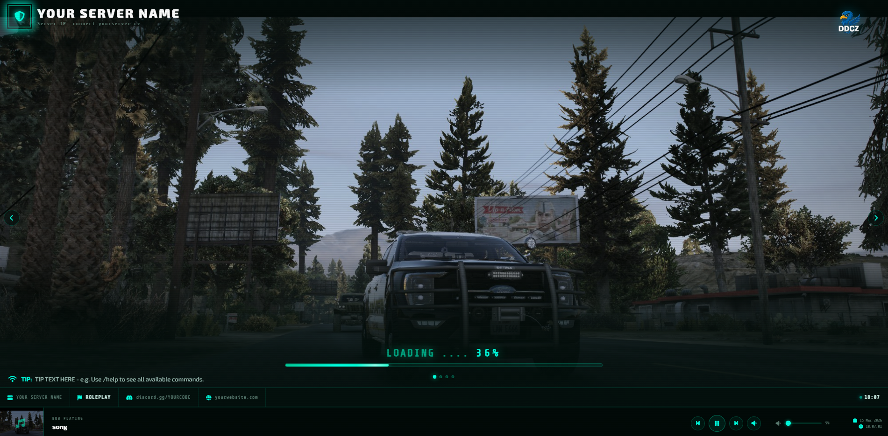
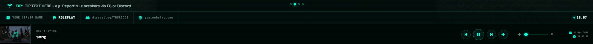

# 🖥️ DDCZ Simple Loading Screen

<div align="center">


**A free, cinematic fullscreen loading screen for FiveM servers.**\
Clean design · Easy config · No dependencies

[](https://fivem.net)
[](LICENSE.md)
[](#)
[](#)

</div>

---

## 📸 Preview

> _screenshots_

| Loading Screen | Music Player |
|:-:|:-:|
|  |  |

> 🎬 https://www.youtube.com/watch?v=LvjLMtsanOQ

---

## ✨ Features

| Feature | Description |
|---------|-------------|
| 🎬 **Fullscreen Background** | Images and videos fill the entire screen |
| 🖼️ **Gallery Slideshow** | Multiple images with smooth fade transitions |
| 🎥 **Video Support** | Local `.mp4` files as animated background |
| 🎵 **Music Player** | Multiple tracks · volume · play/pause/skip |
| 💡 **Rotating Tips** | Custom server tips below the loading bar |
| 🔗 **Info Bar** | Discord & Website links · live clock |
| 🖼️ **Custom Logo** | Your logo top-right, transparent PNG supported |
| ⚙️ **Single Config File** | Everything in one `config.js` — no coding needed |
| 🆓 **Completely Free** | No licence key · no obfuscation · open source |

---

## 📁 File Structure

```
ddcz-simpleloadingscreen/
├── 📄 fxmanifest.lua        ← Resource manifest (add new files here)
├── 📄 client.lua            ← Shutdown handler (do not edit)
├── 📄 LICENSE.md            ← Licence
└── 📁 html/
    ├── 📄 index.html        ← UI (do not edit)
    ├── ⚙️ config.js         ← YOUR CONFIG FILE
    ├── 🖼️ logo.png          ← Your server logo
    ├── 🎵 song.mp3          ← Background music
    ├── 🎬 video1.mp4        ← Background video
    └── 📁 gallery/
        ├── photo1.jpg
        ├── photo2.webp
        └── photo3.png
```

---

## 🚀 Installation

**1.** Drop the `ddcz-simpleloadingscreen` folder into your `resources/` directory

**2.** Add to your `server.cfg`:
```
ensure ddcz-simpleloadingscreen
```

**3.** Open `html/config.js` and fill in your server details

**4.** Restart the resource:
```
ensure ddcz-simpleloadingscreen
```

> ✅ Done! The loading screen is now active.

---

## ⚙️ Configuration

> **The only file you need to edit is `html/config.js`**

```js
const CONFIG = {

    // ── Server identity ──────────────────────────────────────
    serverName:  'YOUR SERVER NAME',
    serverIp:    'connect.yourserver.cz',
    gameMode:    'ROLEPLAY',

    // ── Logo (place file in html/) ───────────────────────────
    logoFile:    'logo.png',      // leave '' for placeholder

    // ── Links ────────────────────────────────────────────────
    discordUrl:  'https://discord.gg/YOURCODE',
    websiteUrl:  'https://yourwebsite.com',

    // ── Music ────────────────────────────────────────────────
    musicFiles:  ['song.mp3'],
    musicVolume: 0.05,            // 0.0 = silent, 1.0 = max

    // ── Gallery (images + videos) ────────────────────────────
    galleryInterval: 6000,        // ms per image slide
    gallery: [
        { type: 'image', src: 'gallery/photo1.jpg', caption: '' },
        { type: 'video', src: 'video1.mp4',          caption: '' },
    ],

    // ── Tips ─────────────────────────────────────────────────
    tipInterval: 6000,
    tips: [
        'Use /help to see all available commands.',
        'Report rule breakers via F8 or Discord.',
    ],
};
```

---

## 🖼️ Adding Your Own Content

### Adding images

1. Place the image in `html/gallery/`
2. Register it in `fxmanifest.lua` → `files {}`:
   ```lua
   'html/gallery/photo4.jpg',
   ```
3. Add it to `config.js`:
   ```js
   { type: 'image', src: 'gallery/photo4.jpg', caption: 'Your caption' },
   ```

### Adding a video

> ⚠️ Videos must be placed **directly in `html/`** — not in `html/gallery/`

1. Place the `.mp4` in `html/`
2. Register in `fxmanifest.lua`:
   ```lua
   'html/video2.mp4',
   ```
3. Add to `config.js`:
   ```js
   { type: 'video', src: 'video2.mp4', caption: '' },
   ```

### Adding music

1. Place the `.mp3` in `html/`
2. Register in `fxmanifest.lua`:
   ```lua
   'html/song2.mp3',
   ```
3. Add to `config.js`:
   ```js
   musicFiles: ['song.mp3', 'song2.mp3'],
   ```

---

## ❓ FAQ

<details>
<summary><b>🎬 Video is not playing</b></summary>

Make sure the `.mp4` file is placed **directly in `html/`** — not inside `html/gallery/`.
Also check that it is registered in `fxmanifest.lua` → `files {}`.
Then do a full resource restart: `ensure ddcz-simpleloadingscreen`

</details>

<details>
<summary><b>🎵 Music is not playing</b></summary>

Music starts on the player's **first click or keypress** — this is a browser autoplay restriction in FiveM's CEF engine. The file must be in `html/` and registered in `fxmanifest.lua`.

</details>

<details>
<summary><b>🔄 My changes are not showing</b></summary>

After editing `config.js` or `fxmanifest.lua` you must do a **full resource restart**:
```
ensure ddcz-simpleloadingscreen
```
A simple `refresh` is not enough — FiveM caches NUI files.

</details>

<details>
<summary><b>🖼️ Logo has a black background</b></summary>

Use a transparent `.png` file. Export your logo with transparency from Photoshop, Paint.NET, or use an online tool like [remove.bg](https://remove.bg).

</details>

<details>
<summary><b>📺 Can I use a YouTube video?</b></summary>

No — YouTube embeds are blocked by FiveM's CEF browser. Download your video as `.mp4` using [yt-dlp](https://github.com/yt-dlp/yt-dlp) and place it in `html/`.

</details>

---

## 📋 Requirements

| Requirement | Details |
|-------------|---------|
| **FiveM** | Any version supporting `cerulean` manifest |
| **Game** | GTA V |
| **Dependencies** | None — fully standalone |
| **Price** | **Free** |

---

## 📜 Licence

This resource is **free to use** on any FiveM server.\
See [LICENSE.md](LICENSE.md) for full terms.

---

## 🙏 Credits

Made with ❤️ by **DDCZ Dev Team**

> 💬 Questions or issues? Open an [Issue](../../issues) or join our [Discord](https://discord.gg/ddcz)
